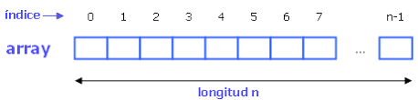

<div align="center">
<table>
    <theader>
        <tr>
            <td></td>
            <th>
                <span style="font-weight:bold;">UNIVERSIDAD NACIONAL DE SAN AGUSTIN</span><br />
                <span style="font-weight:bold;">FACULTAD DE INGENIERÍA DE PRODUCCIÓN Y SERVICIOS</span><br />
                <span style="font-weight:bold;">DEPARTAMENTO ACADÉMICO DE INGENIERÍA DE SISTEMAS E INFORMÁTICA</span><br />
                <span style="font-weight:bold;">ESCUELA PROFESIONAL DE INGENIERÍA DE SISTEMAS</span>
            </th>
            <td></td>
        </tr>
    </theader>
    <tbody>
        <tr><td colspan="3"><span style="font-weight:bold;">Formato</span>: Guía de Práctica de Laboratorio</td></tr>
        <tr><td><span style="font-weight:bold;">Aprobación</span>:  2022/03/01</td><td><span style="font-weight:bold;">Código</span>: GUIA-PRLD-001</td><td><span style="font-weight:bold;">Página</span>: 1</td></tr>
    </tbody>
</table>
</div>

<div align="center">
<span style="font-weight:bold;">GUÍA DE LABORATORIO</span><br />
</div>


<table>
<theader>
<tr><th colspan="6">INFORMACIÓN BÁSICA</th></tr>
</theader>
<tbody>
<tr><td>ASIGNATURA:</td><td colspan="5">Estructura de Datos y Algoritmos</td></tr>
<tr><td>TÍTULO DE LA PRÁCTICA:</td><td colspan="5">Hashing</td></tr>
<tr>
<td>NÚMERO DE PRÁCTICA:</td><td>07</td><td>AÑO LECTIVO:</td><td>2022 A</td><td>NRO. SEMESTRE:</td><td>III</td>
</tr>
<tr>
<td>FECHA INICIO::</td><td>10-Agosto-2022</td><td>FECHA FIN:</td><td>14-Agosto-2022</td><td>DURACIÓN:</td><td>02 horas</td>
</tr>
<tr><td colspan="6">INTEGRANTES:
    <ul>
        <li>Durand Obando, Eduardo Franshua</li>
        <li>Kevin Jheeremy Alvarez Astete</li>
        <li>Henry Isaias Galvez Quilla 3</li>
</td>
</<tr>
<tr><td colspan="6">DOCENTES:
<ul>
<li>Richart Smith Escobedo Quispe - rescobedoq@unsa.edu.pe</li>
</ul>
</td>
</<tr>
</tdbody>
</table>

# Árboles

[![License][license]][license-file]
[![Downloads][downloads]][releases]
[![Last Commit][last-commit]][releases]

[![Debian][Debian]][debian-site]
[![Git][Git]][git-site]
[![GitHub][GitHub]][github-site]
[![Vim][Vim]][vim-site]
[![Java][Java]][java-site]

#

## OBJETIVOS TEMAS Y COMPETENCIAS

### OBJETIVOS

- Conocer el funcionamiento de hashing.
- Aprender a implementar una

### TEMAS
- Tablas Hash
- Hashing

## EJERCICIOS PROPUESTOS
#
- Implementar una tabla hash en base a los métodos definidos en la interfaz del archivo HashTable.java
- Deben contemplar como mínimo el desarrollo de todos los métodos en su clase.
- Deben manejar las colisiones por Encadenamiento (Lista enlazada) y Sondeo Lineal.
- Es posible agregar otros métodos que les ayuden a su resolución.
- Crear un archivo de test donde incluyen casos de prueba.

## RESOLUCIÓN
Dentro del repositorio contamos con una carpeta **src**, la cual contiene 4 archivos .java:

1. **HashTable**: Interfaz que define los métodoso de nuestra tabla hash.
2. **TablaHash**: Clase de la tabla hash que emplea la interfaz **HashTable**
3. **TestHash**: Clase de testeo.
4. **User**: Clase de apoyo para ejemplo.

    ## **TablaHash**
    La tabla hash empleada en este laboratorio tiene la estructura de un arreglo con una determinada cantidad de espacios.

    

    Los métodos propuestos para esta tabla se presentan a continuación:

    - **int size()** //Retorna el numero de clave-valor registrados en la tabla hash.

    - **boolean isEmpty()** // Retorna true si la tabla hash no contiene registros

    - **boolean containsKey(Object key)** // Retorna true si la tabla contiene una clave determinada.

    - **boolean containsValue(Object value)** // Retorna true si la tabla contiene uno o mas registros asociados a cierto valor especificado.

    - **Integer get(String key)** // Retorna el valor el cual corresponde a la clave o null si la tabla no contiene el registro para la clave.

    - **Integer put(String key, Integer value)** // Asocia el valor especificado con la clave especificada a la tabla hash, si la tabla tiene un registro previo para la clave, el valor viejo es reemplazado por el nuevo valor ingresado.

    - **Integer remove(Object key)** // Elimina el registro de una clave, si la clave existe o null si no existe un registro para la clave.

    - **void clear()** // Elimina todos los registros de la tabla hash.

    - **int hashCode()** // Retorna el codigo hash para TODA la tabla hash.

    - Implementacion: Se utilizaron  los códigos hash de desplazamiento cíclico; una variante del código hash polinómico sustituye la multiplicación por a por un desplazamiento cíclico de una suma parcial en un número determinado de bits. Se han hecho experimentos para calcular el número de colisiones en 25.000 palabras en inglés. Se demuestra que 5, 6, 7, 9 y 13 son buenas elecciones de valores de desplazamiento.

```sh
    static int hashCode(String s) {
      int h = 0;
      for (int i = 0; i < s.length(); i++) {
        h = (h << 5) | (h >>> 27); // 5-bit cyclic shift of the running sum
        h += (int) s.charAt(i); // add in next character
      }
      return h;
    }
```

    - **String toString()** // Muestra todos los elementos de la tabla hash.


## REFERENCIAS
[1] Weiss M., Data Structures & Problem Solving Using Java, 2010, Addison-Wesley.

[2] https://www.cpp.edu/~ftang/courses/CS240/lectures/hashing.html

#

[license]: https://img.shields.io/github/license/rescobedoq/pw2?label=rescobedoq
[license-file]: https://github.com/rescobedoq/pw2/blob/main/LICENSE

[downloads]: https://img.shields.io/github/downloads/rescobedoq/pw2/total?label=Downloads
[releases]: https://github.com/rescobedoq/pw2/releases/

[last-commit]: https://img.shields.io/github/last-commit/rescobedoq/pw2?label=Last%20Commit

[Debian]: https://img.shields.io/badge/Debian-D70A53?style=for-the-badge&logo=debian&logoColor=white
[debian-site]: https://www.debian.org/index.es.html

[Git]: https://img.shields.io/badge/git-%23F05033.svg?style=for-the-badge&logo=git&logoColor=white
[git-site]: https://git-scm.com/

[GitHub]: https://img.shields.io/badge/github-%23121011.svg?style=for-the-badge&logo=github&logoColor=white
[github-site]: https://github.com/

[Vim]: https://img.shields.io/badge/VIM-%2311AB00.svg?style=for-the-badge&logo=vim&logoColor=white
[vim-site]: https://www.vim.org/

[Java]: https://img.shields.io/badge/java-%23ED8B00.svg?style=for-the-badge&logo=java&logoColor=white
[java-site]: https://docs.oracle.com/javase/tutorial/


[![Debian][Debian]][debian-site]
[![Git][Git]][git-site]
[![GitHub][GitHub]][github-site]
[![Vim][Vim]][vim-site]
[![Java][Java]][java-site]

[![License][license]][license-file]
[![Downloads][downloads]][releases]
[![Last Commit][last-commit]][releases]
